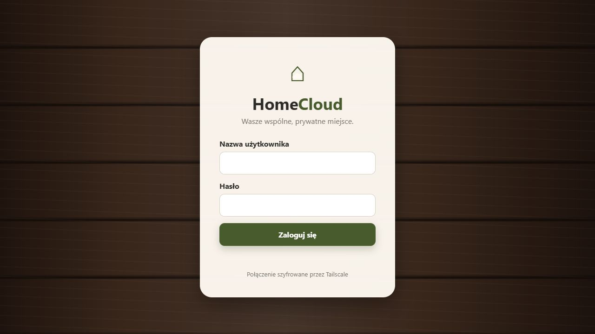
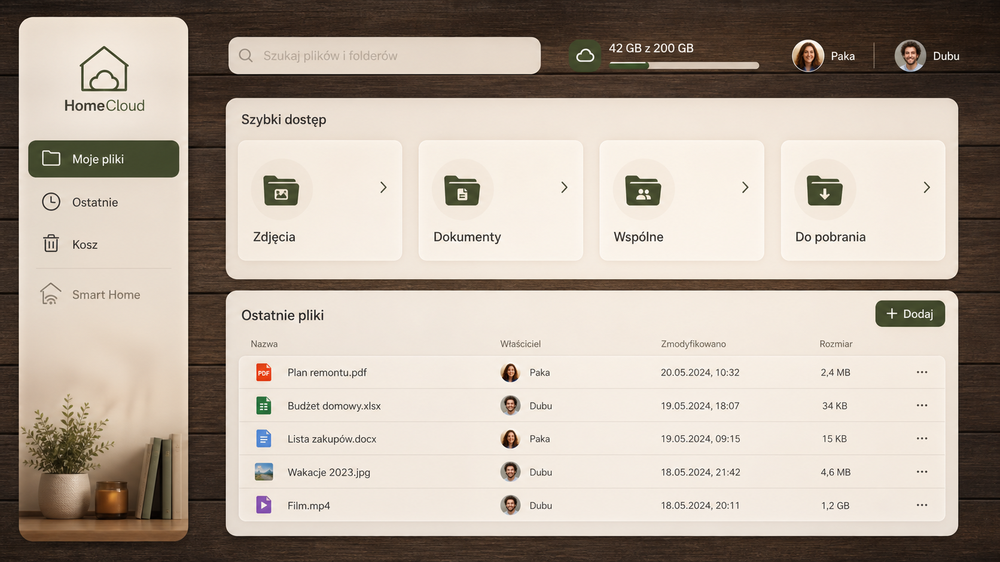

# HomeCloud

[](https://github.com/ProrokIzajasz/HomeCloud/actions/workflows/build.yml)

[Download the latest private portfolio release](https://github.com/ProrokIzajasz/HomeCloud/releases/latest)

C++ foundation for the private-cloud and smart-home application described in
`../PROJECT_1_PLAN.md`. The Vilanous project is unrelated and is not a dependency.

## Demo





The captured interface is served by the real local C++ API. A user signs in, navigates
private folders, uploads or previews files, and can restore deleted items from the trash.
The public repository keeps the server bound to localhost by default.

## Current milestone

- C++20 storage core
- 200 GiB default quota
- safe resolution of user-provided relative paths
- storage usage calculation
- automatic duplicate naming (`file (2).ext`, `file (3).ext`)
- directory creation and sorted directory listings
- file and complete-folder import
- copy, move, and rename operations
- private trash metadata, restoration, and permanent deletion
- Windows command-line status application
- dependency-free storage tests
- persistent user accounts with unique password salts
- PBKDF2-HMAC-SHA256 password hashing (600,000 iterations on Windows)
- random 256-bit in-memory session tokens with expiration and logout
- authenticated HTTP API for health, login, storage status, and file listings
- responsive Polish web interface based on the warm walnut HomeCloud concept
- browser login, file navigation, search, uploads, downloads, previews, and trash

## Web interface

The server hosts the interface from `web/`. Its second optional command-line
argument overrides that location. The current Windows launch is equivalent to:

```powershell
.\build\Debug\homecloud_api.exe D:\PrivateCloud .\web
```

The design uses a dark walnut-board background, warm ivory panels, muted green
controls, responsive desktop/mobile layouts, and an intentionally disabled Smart
Home entry until that module enters development.

## API safety status

The API currently binds only to `127.0.0.1:8080`. Do not expose it directly to
the LAN or internet: TLS or an encrypted private-network layer and login rate
limiting must be completed first.

### HipHop module distribution

Application releases are served by a separate read-only process. This keeps the
private file API on `127.0.0.1:8080`; only the catalog and immutable APK downloads
need to be reachable by a phone.

Publish a release locally on the HomeCloud computer:

```powershell
.\scripts\publish_android_module.ps1 -ModuleId homecloud -Version 0.5.2 -ApkPath .\release\HomeCloud-Android-universal-v0.5.2.apk
.\scripts\publish_android_module.ps1 -ModuleId what-to-eat -Version 0.1.9 -ApkPath C:\path\to\WhatToEat.apk
```

Publishing accepts only the known module ids, validated version strings, and APK
files. It copies through a random staging directory, calculates SHA-256, writes
metadata, and atomically publishes the version. Existing versions cannot be
overwritten.

Start for local testing only:

```powershell
.\scripts\start_module_service.ps1
```

Start for phones on the same trusted Wi-Fi (requires a Windows Firewall inbound
rule for TCP 8081):

```powershell
.\scripts\start_module_service.ps1 -BindAddress 0.0.0.0 -Port 8081
```

If Windows blocks PowerShell scripts, invoke them with
`powershell -ExecutionPolicy Bypass -File <script>`. Run
`scripts\allow_module_service_firewall.ps1` once from Windows PowerShell opened
as Administrator. Its rule is restricted to Private networks, TCP 8081, and the
exact `homecloud_modules.exe` program.

Set HipHop's catalog URL to `http://<homecloud-lan-ip>:8081/api/hiphop/modules`.
For remote internet access, keep the service bound to localhost and publish only
`/api/hiphop/*` through an HTTPS reverse proxy or an encrypted private network.

Module routes:

- `GET /api/hiphop/health`
- `GET /api/hiphop/modules`
- `GET /api/hiphop/modules/<id>/<version>/download?platform=android`

Current routes:

- `GET /api/v1/health`
- `POST /api/v1/login` (`username` and `password` form fields)
- `POST /api/v1/logout` (Bearer token)
- `GET /api/v1/storage` (Bearer token)
- `GET /api/v1/files?path=...` (Bearer token)
- `GET /api/v1/files/manifest?path=...` (Bearer token; recursive)
- `POST /api/v1/directories?path=...` (Bearer token)
- `POST /api/v1/upload?filename=...&destination=...` (Bearer token, raw body)
- `GET /api/v1/download?path=...` (Bearer token)
- `GET /api/v1/preview?path=...` (Bearer token)
- `GET /api/v1/search?query=...` (Bearer token)
- `POST /api/v1/files/copy?source=...&destination=...` (Bearer token)
- `POST /api/v1/files/move?source=...&destination=...` (Bearer token)
- `POST /api/v1/files/rename?source=...&name=...` (Bearer token)
- `DELETE /api/v1/files?path=...` (Bearer token; moves to trash)
- `GET /api/v1/trash` (Bearer token)
- `POST /api/v1/trash/restore?id=...` (Bearer token)
- `DELETE /api/v1/trash?id=...` (Bearer token; permanent)
- `DELETE /api/v1/trash/all` (Bearer token; empties trash)

Uploads are streamed to an internal staging location and atomically moved into
the requested cloud folder after their declared size is verified. Downloads are
served as streams and support the HTTP library's file-range handling. Login is
limited to five failed attempts per client address in a rolling five-minute
window.

Trash entries carry a deletion timestamp. Entries older than 30 days are
automatically purged when the server starts.

Folder uploads preserve their structure by sending each file with a validated
`relativePath` parameter. Missing parent folders are created by the server. A
recursive manifest lets clients reproduce empty folders and download complete
directory trees without loading the tree into server memory.

Inline previews currently support JPEG, PNG, GIF, WebP, BMP, PDF, MP4, WebM,
and QuickTime MOV. Other formats return HTTP 415 and remain downloadable.

For an empty development data directory, an initial account can be created once
from the `HOMECLOUD_BOOTSTRAP_USER` and `HOMECLOUD_BOOTSTRAP_PASSWORD`
environment variables. They should be removed immediately after the first start.

## Local account administration

Create each of the two real accounts locally. Password input is hidden and must
be repeated; passwords never appear in process arguments.

```powershell
.\build\Debug\homecloud_admin.exe D:\PrivateCloud create-user <username>
.\build\Debug\homecloud_admin.exe D:\PrivateCloud list-users
```

Usernames contain 3-32 letters, digits, underscores, or hyphens. Passwords must
be at least 12 bytes. Both accounts currently have identical cloud permissions.

Tailscale was not detected on the development computer on 16 August 2026. The
API therefore remains bound to localhost until encrypted access is configured.

The temporary Windows storage location is `D:\PrivateCloud`. The path can be
overridden by passing another directory as the first command-line argument.
On Linux/Raspberry Pi the default path is `/srv/homecloud/data`.

## Build

```powershell
cmake -S . -B build
cmake --build build --config Debug
ctest --test-dir build -C Debug --output-on-failure
```

### Raspberry Pi / Debian

The Linux build uses OpenSSL 3 for secure random generation, PBKDF2-HMAC-SHA256,
and constant-time hash comparison. Install the compiler, CMake, and OpenSSL
development package, then build normally:

```bash
sudo apt install build-essential cmake libssl-dev
cmake -S . -B build -DCMAKE_BUILD_TYPE=Release
cmake --build build --parallel
ctest --test-dir build --output-on-failure
```

Windows uses the native BCrypt provider and Linux uses OpenSSL. Both providers
are checked against the same PBKDF2 compatibility vector, so the user database
can move with the cloud data.

No open-source license is granted for this private portfolio project.

## Third-party code

`third_party/cpp-httplib` contains cpp-httplib v0.51.0 and its license. The
version is pinned instead of downloaded during every build.
